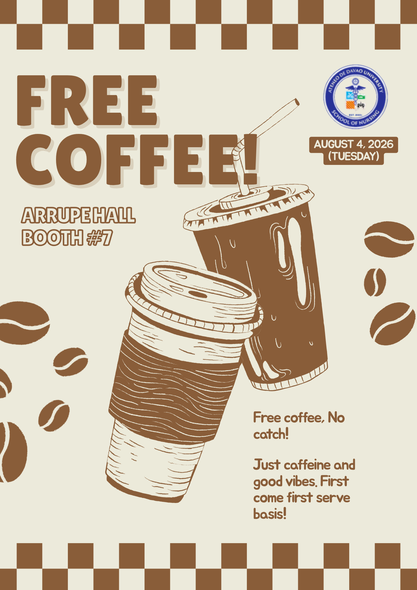

# Activity 1 – Presentation Design Principles

## Overview

For Activity 1, I created a promotional poster for a free coffee event. The poster provides the important event information while using visual design principles to make the announcement attractive, readable, and engaging.

## Concept

The concept of the poster is centered around coffee and a warm, inviting atmosphere. I used coffee cups and coffee beans as the main visual elements to immediately communicate the theme of the event.

The design promotes a free coffee giveaway with the details:

- **Date:** August 4, 2026 (Tuesday)
- **Location:** Arrupe Hall, Booth #7
- **Offer:** Free coffee

## Design Principles

- **Visual Hierarchy:** Made "FREE COFFEE" the main focal point using large, bold tex, following the supporting details such as the date and location.
- **Contrast:** Used dark brown and light cream to make the elements stand out.
- **Balance:** Arranged text, illustrations, and decorative elements evenly.
- **Consistency:** Used the same brown-and-cream color scheme and coffee theme throughout.
- **Emphasis:** Used the large title and coffee illustrations to attract attention.

## Final Output

## Reflection

This activity helped me understand how presentation and visual design principles can be used to communicate information effectively. I learned that the arrangement of elements, choice of colors, typography, and use of visual emphasis can greatly affect how quickly and clearly an audience understands a message.
