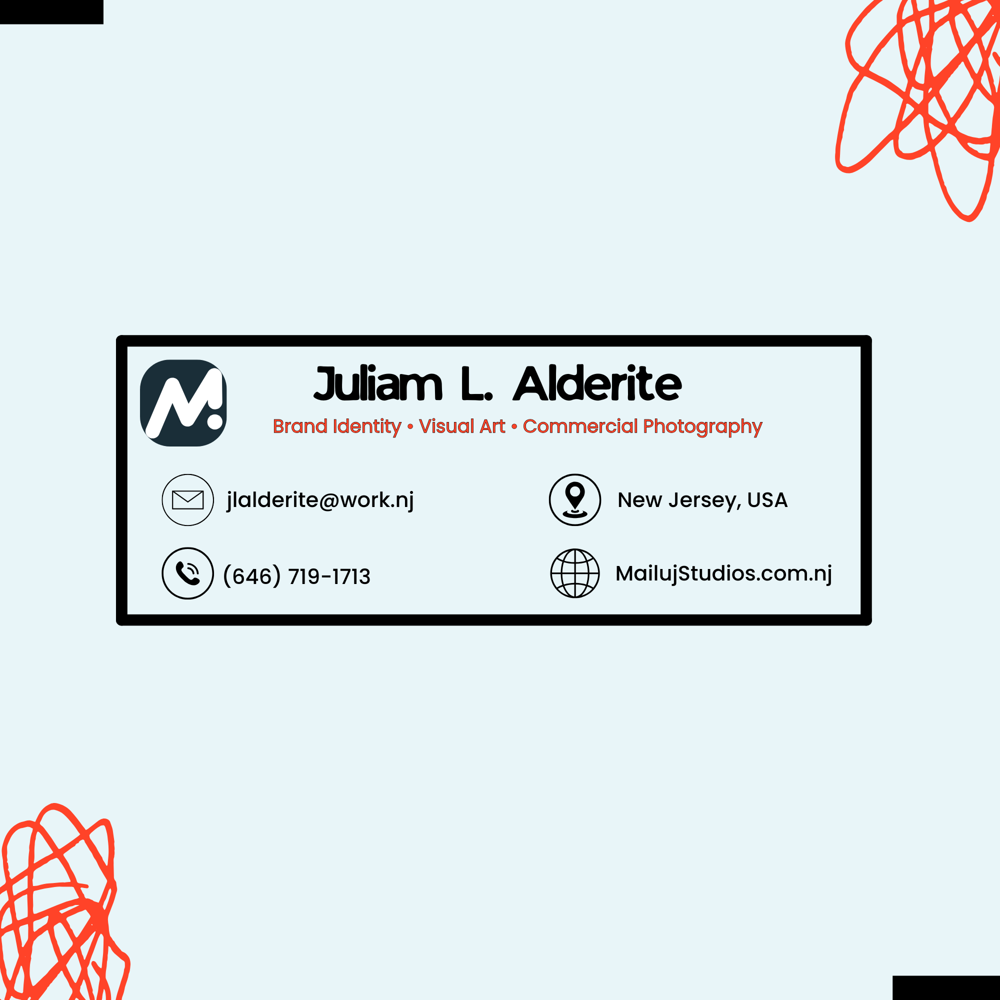
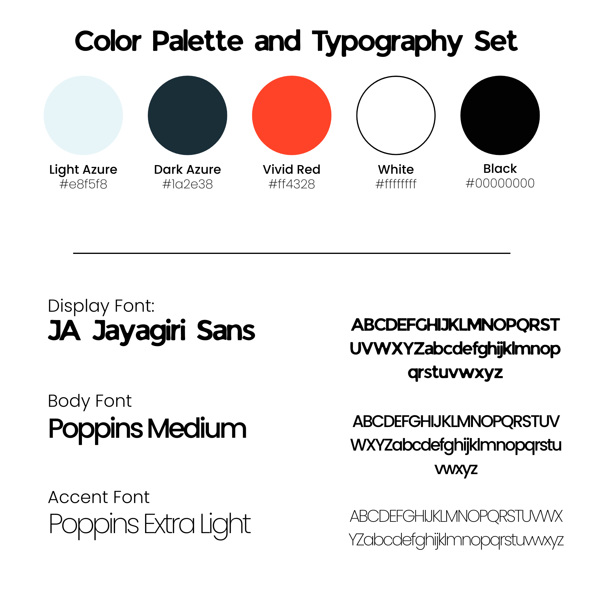

# Activity 2 – Color Palette and Typography

## Concept
A personal branding set designed to create a consistent and recognizable visual identity.

## Outputs
- Personal Logo
- Tagline
- Header
- Color Palette and Typography Set

## Color Palette
- **Light Azure:** #e8f5f8
- **Dark Azure:** #1a2e38
- **Vivid Red:** #ff4328
- **White:** #ffffffff
- **Black:** #00000000

## Typography
- **Display Font:** JA Javagiri Sans
- **Body Font:** Poppins Medium
- **Accent Font:** Poppins Extra Light

## Design Principles
- **Consistency:** Used the same colors and typography throughout the branding materials.
- **Contrast:** Combined dark, light, and vivid colors to make important elements stand out.
- **Hierarchy:** Used different font styles and weights to distinguish headings, body text, and accents.
- **Balance:** Arranged the logo, text, and graphic elements to create a clean composition.

## Development
I developed the branding set by creating a personal logo and tagline, then applying the selected color palette and typography to create a consistent visual identity.

## Final Outputs

### Personal Logo

### Tagline

### Header

### Color Palette and Typography

